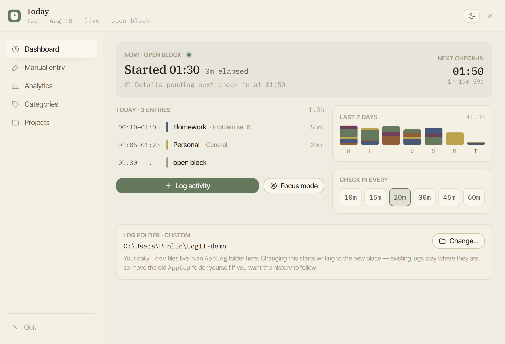
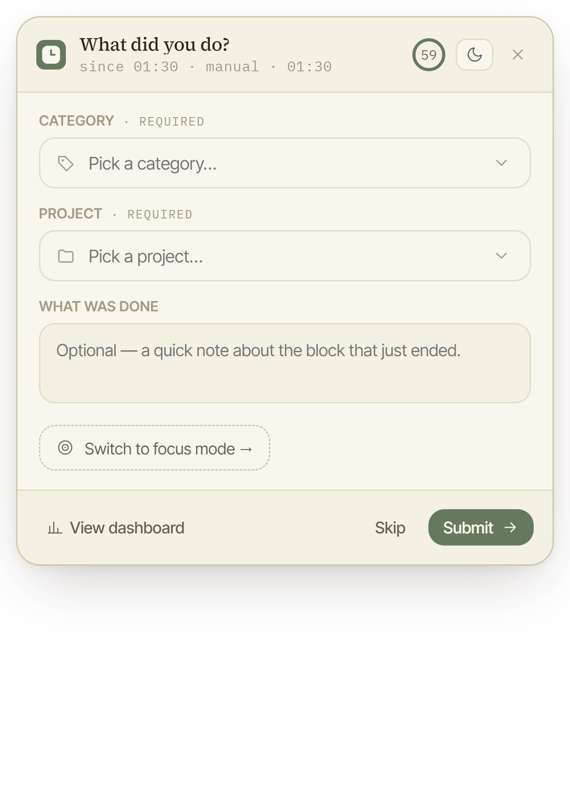
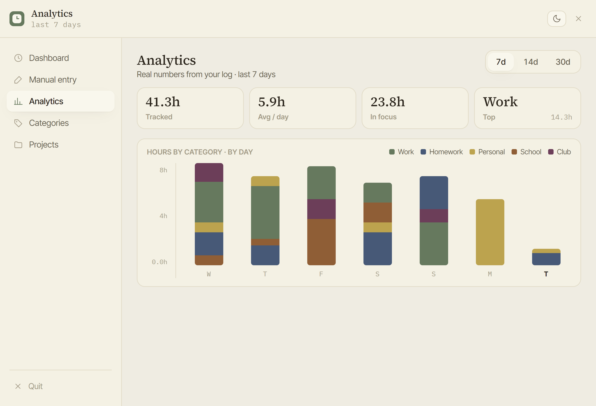

<div align="center">

# LogIT

**A local-first desktop time logger that asks what you just did — and appends it to a plain CSV you own outright.**

No account. No cloud. No database. No telemetry. *The log is the product.*

[](LICENSE)
[](#install)
[](#architecture)
[](#testing)

</div>



---

## The problem

Timers make you remember to start them. Automatic trackers watch your screen and still can't tell
work from procrastination. LogIT takes the third option: it runs quietly in the background and every
*N* minutes asks one question — **"what did you just do?"** You answer in five seconds; it closes the
block that just ended and opens a new one.

The principle that shapes everything else: **every prompt describes the block that is *closing*, not
the one that is opening.** You are never asked to predict what you are about to do — you describe
what you actually did, while you still remember it.

## What it does

| | |
|---|---|
| **Check-ins** | Every 10–60 min it asks what you just did, closes that block and opens the next |
| **Focus sessions** | Declare deep work with an end time; check-ins go quiet until it is over |
| **Manual entries** | Back-fill any past date after the fact |
| **Analytics** | 7/14/30-day rollups, hours by category, time spent in focus |
| **Libraries** | Editable category and project lists with stable per-name colours |
| **Absence detection** | Walk away for an hour and it discards the unfinished block instead of inventing work |

<table>
<tr>
<td width="40%"></td>
<td></td>
</tr>
<tr>
<td align="center"><em>The check-in: a 60-second countdown, then it takes the honest path for its context</em></td>
<td align="center"><em>Analytics recomputed from the raw files on every view — no cache to invalidate</em></td>
</tr>
</table>

---

## How it works

The app is always in exactly **one of three states**, with a single hard invariant tying that state
to the bytes on disk:

> `state == ACTIVE` ⟺ exactly one row in today's log has an empty end time.

```
                    Start logging / Begin focus
                  ─────────────────────────────►
   ┌────────────┐                            ┌──────────────────────┐
   │            │ ◄── Skip (deletes row) ──  │       ACTIVE         │
   │  INACTIVE  │ ◄── engagement timeout ──  │  ┌────────────────┐  │
   │            │ ◄── focus end / timeout ─  │  │ normal │ focus │  │
   │ no open row│                            │  └────────────────┘  │
   └────────────┘                            │     one open row     │
                                             └──────────────────────┘
                                                   │        ▲
                                                   └────────┘
                                             check-in submit (loops)
```

One check-in component fires in **five different contexts**, and the context decides which buttons
exist and — the part that is easy to get wrong — what a *timeout* writes:

| Context | Fires when | Skip? | Dismissible? | On timeout |
|---|---|---|---|---|
| `INTERVAL` | the timer fires | yes | yes | close block with `window timed out`, open a new one |
| `OFF_CYCLE` | you tap the floating button | yes | yes | same |
| `FOCUS_END` | a focus session ends | **no** | **no** | close block, **no** new one → INACTIVE |
| `FOCUS_INTERRUPT` | you interrupt a live session | **no** | yes *(session keeps running)* | end the session |
| `EXIT_PROMPT` | you quit with a block open | yes | yes *(cancels the quit)* | close block, then quit |

Four timers drive it: the **interval**, the popup **countdown**, the **focus-end** timer, and a
one-hour **engagement timer** — a dead-man's switch. If you walk away mid-block, an hour later the
app deletes the unfinished row and stops prompting, instead of recording an eight-hour session that
never happened. Crucially, **a popup timing out does not count as engagement** — it is the evidence
that nobody is there.

## Architecture

```
  log layer      read / append / close / delete rows; owns the folder layout and
                 file locking. THE ONLY code that knows where files live.
  settings       load, save-on-change, interval snapping, colour assignment
  core           state machine + scheduler + the four timers. No UI imports, and
                 no clock it cannot be handed a fake for.
  ─────────────  everything above is verifiable without drawing a pixel
  surfaces       shell + 5 panes, 3 popups, floating shortcut, toast (React)
```

The rules that keep it that way:

- **The core never imports a UI type.** The UI observes the core; the core does not know it exists.
  Every visual effect goes through an injected `surface` port, so tests substitute a recorder.
- **Every read and write goes through the log layer.** The previous version rebuilt file paths in
  four separate places and they drifted apart. Now exactly one module knows the folder shape.
- **Derived numbers are computed once, in one place** (`src/shared/derive.js`) — the fix for four
  screens showing four slightly different hour totals.
- **One state machine, not a set of booleans that happen to agree.** The old build had five flags for
  three states, and they could contradict each other.

## Testing

```
$ npm test
# tests 64
# pass 64
# fail 0
```

The interesting part: **the entire state machine is tested headlessly**, with no window ever opening.
Time is injected — a fake clock plus a fake timer factory — so a test can advance an hour instantly
and then assert on the bytes that actually landed in the file:

```js
test('an hour of popup timeouts does not postpone engagement; the open row is discarded', ...)
test('check-in timeout closes with the marker, opens a new row, and does NOT reset engagement', ...)
test('focus end passing while the interrupt popup is open defers, then fires on dismissal', ...)
test('a failed save keeps the popup open, counts attempts, and echoes at attempt 3', ...)
```

Every row of the specification's event→effect table has a corresponding assertion. The log-layer
suite covers RFC 4180 quoting round-trips, both on-disk folder layouts, midnight-spanning rows and
retry-on-locked-file.

## Engineering decisions worth reading

Each of these is a case where the obvious implementation is wrong:

- **The open row is found by scanning for an empty end time — never by taking the last line.** A
  manual back-fill can append a *closed* row after the open one, so "last line" silently corrupts the
  wrong entry. This was the nastiest bug in the previous version.
- **Skip deletes the block rather than closing it.** That time becomes untracked, which is the honest
  record of "I would rather not say" — better than a block labelled with nothing.
- **A failed write never closes the window.** After three failed attempts the app echoes your exact
  typed text back so you can re-enter it. It never claims a save it did not make.
- **Rewrites are atomic** (temp file, then rename), because the log is often open in Excel and a
  half-written day would be unrecoverable.
- **The log format is frozen.** Years of real entries have to keep parsing, including legacy rows
  with a mode this version will never write again.
- **Moving the log folder carries the open block across** — appending it to the new location before
  removing it from the old — because otherwise it would be stranded where the app could never close
  it, breaking the core invariant.

---

## Install

### Windows

Grab the latest from [**Releases**](https://github.com/amytis25/LogIT-V3/releases):

- **`LogIT Setup <version>.exe`** — installer, adds a Start-menu entry
- **`LogIT <version>.exe`** — portable single file, nothing installed

> Windows warns on first run, because the download is not code-signed (certificates cost a few
> hundred dollars a year). Click **More info → Run anyway**, or build it yourself below.

### macOS

Mac apps can only be built on a Mac, so there is no prebuilt download — but it is two commands:

```bash
git clone https://github.com/amytis25/LogIT-V3.git
cd LogIT-V3
npm install
npm run dist
```

That produces `release/LogIT-<version>.dmg`. It is not notarised, so macOS blocks the first launch:
right-click the app → **Open** → **Open**, once. Requires [Node.js](https://nodejs.org) 18+.

> **Honesty note:** LogIT is built and used daily on Windows. The macOS target is configured and
> there is no Windows-specific logic in the code, but nobody has actually run it on a Mac yet.

### From source

```bash
npm install
npm test     # headless suites: log layer, settings, derived numbers, state machine
npm start    # build the renderer and launch
npm run dist # package for the current platform
```

**Using it:** press **Start logging** and the window gets out of your way, leaving a small floating
button in the corner of the screen. Double-click it any time to log what you just did. The **X** on
any window closes only that window — just **Quit** in the sidebar exits the app.

## Your data

```
Documents\LogIT\
  settings.json                             interval, theme, libraries, colours
  AppLog\2026\08-August\2026-08-18.csv      one file per day
```

```csv
start_time,end_time,mode,category,project,additional_notes
09:30,11:15,focus,Homework,Problem set 4,Convolution problems
11:15,12:00,normal,Personal,General,Lunch and a walk
13:00,,normal,,,
```

Six columns, `HH:MM` times, RFC 4180 quoting, UTF-8. That last row is the open block. Plain files —
greppable, Excel-openable, yours. The app never deletes a closed row; the only thing it can remove is
the single *unfinished* block. The dashboard has a **LOG FOLDER** field if you would rather keep them
somewhere else.

---

## How this was built — an AI disclaimer

Worth stating plainly, since you are deciding whether to run a stranger's software.

**Written by Claude** (Anthropic's Claude Opus, across a single working session): essentially all of
the code that runs — roughly **5,600 lines** across `src/` (state machine, scheduler, log layer,
settings, every screen), `tests/` (~900 lines), the icon generator and the build configuration.

**Specified, designed, directed and reviewed by [@amytis25](https://github.com/amytis25)** — the
parts that decide what the software actually *is*:

- **[`FUNCTIONAL_SPEC.md`](FUNCTIONAL_SPEC.md)** — ~1,100 lines pinning down every behaviour, state,
  timer, popup context and edge case, with ASM charts, an event→effect table and an acceptance
  checklist. Written *before* any code existed; the implementation was built to it, not the reverse.
- **[`CLAUDE.md`](CLAUDE.md)** — the engineering rules the model was held to: the hard invariants,
  the architecture, and a standing instruction to push back rather than agree.
- The complete **visual design** (`design_handoff/`) — layout, typography, colour and every screen,
  prototyped ahead of implementation.
- Every product decision and correction, found by using the real app daily: the dashboard must
  disappear once logging starts and only return when asked; the **X** must close a window rather than
  quit the app; the floating button was twice the size it should be; the log folder had to be
  user-choosable.

So: a person specified it, designed it, used it daily and corrected it in rounds against a running
build; a model did the typing. The judgement is hers; the bugs are the model's.

The full history is here if you want it — [`UPDATES.md`](UPDATES.md) records every decision and why,
and [`GOTCHAS.md`](GOTCHAS.md) records the traps, including the embarrassing ones.

## Project layout

```
src/main/       Electron main: state machine, scheduler, log layer, settings,
                window manager — no UI knowledge, tested headless
src/shared/     constants and derived-number maths, shared by both sides
src/preload/    the narrow IPC bridge exposed to windows
src/renderer/   React UI: shell + panes, popups, floating shortcut, toast
tests/          node:test suites
docs/PLAN.md    the phased implementation plan
design_handoff/ read-only visual reference the UI was built from
```

## Status

Working and in daily use, but it is a personal project shared with friends — not a supported product.
No auto-update, no crash reporting, no way to phone home. If it breaks, your data is still sitting
there in plain CSV files, which was rather the point.

## License

[MIT](LICENSE) — use it, change it, share it. No warranty of any kind.
